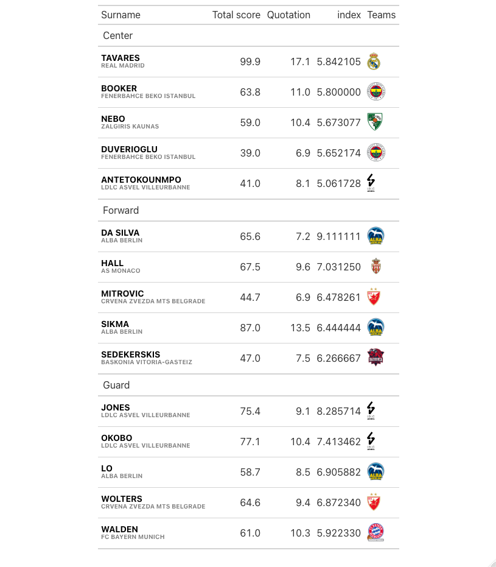

# Euroleague-Fantasy


## Install package
Install the package using the following commands  
```r 
# work in progress

```
<br>
<br>
<br>
<br>
<br>
<br>
<br>
<br>
<br>
<br>
<br>
<br>
<br>


## Top5 players in each position - Round5

