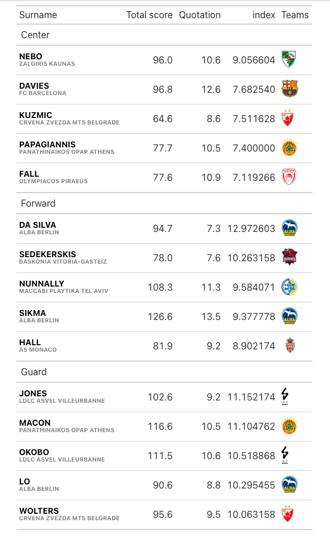

# Euroleague-Fantasy


## Install package
Install the package using the following commands  
```r 
# work in progress

```
<br>
<br>
<br>
<br>
<br>
<br>
<br>
<br>
<br>
<br>
<br>
<br>
<br>


## Top5 players in each position - Round5
Here I am taking into consideration the ratio of the "_Total score_" of each player over his "_Quotation_" (index = Total score / Quotation). 
In simple words, I am investigating the value for money of each player. 


## Top5 players in each position - Round6
Based on this table, I am selecting the players of my team for the next round. Soon comes my MCMC algorithm in which you can put your top players and makes you the "best team".
<br>


## Top5 players in each position - suggestions for Round8
Based on this table, I am selecting the players of my team for the next round. Soon comes my MCMC algorithm in which you can put your top players and makes you the "best team".
<br>


## Top5 players in each position - suggestions for Round9
Based on this table, I am selecting the players of my team for the next round. Soon comes my MCMC algorithm in which you can put your top players and makes you the "best team".
<br>



## Top5 players in each position - suggestions for Round10


### Have a look at the eurolig package data 
https://solmos.netlify.app/post/2019-11-28-introduction-to-eurolig/introduction-to-eurolig/

## MCMC algorithm to find the best team
```
repeat {
  idx <- unlist(
    Map(
      sample,
      split(1:nrow(df), df$role),
      c(2, 4, 4)
    )
  )
  s <- sum(df$score[idx])
  if (s >= 95.5 & s <= 100.4) break
}
df[sort(idx), ]
```
